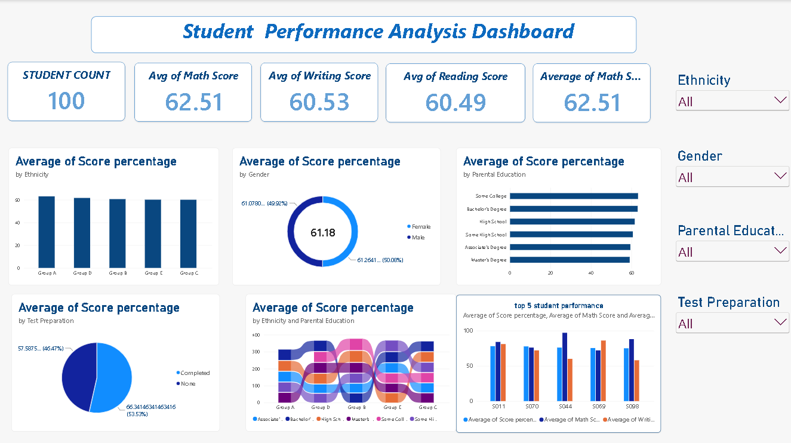

# Student Performance Analysis Dashboard

An interactive Power BI dashboard that analyzes student exam scores to understand how gender, ethnicity, parental education and test preparation relate to academic performance.

## Dataset
Student marks data with the following fields: Student ID, Gender, Ethnicity, Parental Education, Test Preparation, Math Score, Reading Score, Writing Score and Score Percentage.

## Dashboard Features
- **KPI cards:** Student Count, Average Math Score, Average Writing Score, Average Reading Score
- **Average score percentage by Ethnicity** (column chart)
- **Average score percentage by Gender** (donut chart)
- **Average score percentage by Parental Education** (bar chart)
- **Average score percentage by Test Preparation** (pie chart)
- **Score percentage by Ethnicity and Parental Education** (ribbon chart)
- **Top 5 student performance** (clustered column chart comparing score percentage, math and writing scores)
- **Slicers:** Ethnicity, Gender, Parental Education, Test Preparation

## Questions This Dashboard Answers
- Does completing test preparation improve scores?
- How does parental education level relate to student performance?
- Is there a performance gap between genders or ethnic groups?
- Who are the top performing students?

## Tools
Power BI, Power Query, DAX

## How to Use
1. Download `power bi project.pbix`
2. Open it in Power BI Desktop
3. Use the slicers on the right to filter the dashboard
